# Options

claude-flow automation mle-star [options]

Required:
  --dataset <path>          Path to dataset file (default: ./data/dataset.csv)
  --target <column>         Target column name (default: target)

Core Options:
  --claude                  Enable Claude CLI integration (recommended)
  --output <dir>            Model output directory (default: ./models/)
  --name <experiment>       Experiment name for tracking

Iteration Control:
  --search-iterations <n>   Web search iterations (default: 3)
  --refinement-iterations <n> Refinement cycles (default: 5)
  --max-agents <n>          Maximum agents to spawn (default: 6)

Execution Modes:
  --interactive             Use interactive mode with master coordinator
  --non-interactive         Force non-interactive mode (default)
  --output-format <format>  Output format (stream-json enables chaining)

Advanced:
  --chaining                Enable stream-json chaining between agents
  --no-chaining             Disable stream-json chaining
  --timeout <ms>            Execution timeout (default: 4 hours)
  --verbose                 Enable detailed logging
  --no-claude-warning       Suppress Claude integration warnings

  # Example Output

  🧠 MLE-STAR: Machine Learning Engineering via Search and Targeted Refinement
🎯 This is the flagship automation workflow for ML engineering tasks

📋 Workflow: MLE-STAR Machine Learning Engineering Workflow
📄 Description: Complete Machine Learning Engineering workflow using MLE-STAR methodology
🎓 Methodology: Search → Foundation → Refinement → Ensemble → Validation
⏱️  Expected Runtime: 2-4 hours

📊 Configuration:
  Dataset: customer-churn.csv
  Target: churn
  Output: ./models/churn/
  Claude Integration: Enabled
  Execution Mode: Non-interactive (default)
  Stream Chaining: Enabled

🔗 Stream chaining enabled: Agent outputs will be piped to dependent agents

📋 Executing 6 tasks in 3 phases...

🔄 Phase 1: 2 concurrent tasks
╔═══════════════════════════════════════════════════════════════╗
║                    🤖 CONCURRENT TASK STATUS                   ║
╠═══════════════════════════════════════════════════════════════╣
║ ⠋ RUNNING (2 agents):                                          ║
║   🔍 Web Search Research          [██████████] 4m 23s          ║
║   📊 Dataset Analysis             [████████░░] 3m 15s          ║
║ ✅ COMPLETED (0):                                              ║
║ ⏳ QUEUED: 4 tasks waiting                                     ║
╠═══════════════════════════════════════════════════════════════╣
║ 📊 Progress: 33% (2/6) │ ⚡ Active: 2 │ ❌ Failed: 0          ║
╚═══════════════════════════════════════════════════════════════╝

🔄 Phase 2: 2 concurrent tasks
  🔗 Enabling stream chaining from web_search_phase to foundation_building
  🔗 Enabling stream chaining from dataset_analysis to ablation_analysis
  
  🚀 Starting: Foundation Model Creation
     Agent: foundation_agent
     🔗 Chaining: Piping output from search_agent

  🚀 Starting: Ablation Analysis  
     Agent: refinement_agent
     🔗 Chaining: Piping output from foundation_agent

🔄 Phase 3: 2 concurrent tasks
  🔗 Enabling stream chaining from targeted_refinement to ensemble_creation
  🔗 Enabling stream chaining from ensemble_creation to validation_and_debugging

🎉 MLE-STAR workflow completed successfully!
📊 Results: 6/6 tasks completed
⏱️  Duration: 2h 47m 18s
🆔 Execution ID: workflow-exec-1704067200000

📈 Key Results:
  ✅ web_search_phase: Found 15 SOTA approaches, 8 Kaggle winners
  ✅ dataset_analysis: Identified 3 data quality issues, 12 key features
  ✅ foundation_building: Built 4 baseline models, best: 0.734 AUC
  ✅ ablation_analysis: Feature engineering +12.3% impact (highest)
  ✅ targeted_refinement: Optimized top components, +18.7% improvement
  ✅ ensemble_creation: Stacking approach, final: 0.891 AUC
  ✅ validation_and_debugging: No leakage detected, production ready

💡 Next Steps:
  • Check models in: ./models/churn/
  • Review experiment: customer-churn-prediction  
  • Validate results with your test data
  • Deploy using generated API endpoints

```mermaid
graph TB
    subgraph "Phase 1: Discovery & Foundation (Parallel)"
        A[🔍 Web Search Agent<br/>Research SOTA approaches<br/>Find winning solutions]
        B[📊 Foundation Agent<br/>Analyze dataset<br/>Build baseline models]
    end
    
    subgraph "Phase 2: Analysis & Refinement (Sequential)"  
        C[🔬 Ablation Agent<br/>Identify high-impact<br/>components via testing]
        D[⚡ Refinement Agent<br/>Deep optimization of<br/>critical components]
    end
    
    subgraph "Phase 3: Ensemble & Validation (Parallel)"
        E[🏛️ Ensemble Agent<br/>Intelligent combination<br/>Meta-learning strategies]
        F[✅ Validation Agent<br/>Comprehensive testing<br/>Production readiness]
    end
    
    G[🚀 Production Deployment<br/>Monitoring & Documentation]
    
    A --> C
    B --> C
    C --> D
    D --> E
    D --> F
    E --> G
    F --> G
    
    style A fill:#e3f2fd
    style B fill:#e8f5e8
    style C fill:#fff3e0
    style D fill:#fce4ec
    style E fill:#f3e5f5
    style F fill:#e0f2f1
    style G fill:#ffebee
```



  # Base prompts

  **1.**

```text
# Competition
{task description}

# Your task
- List {M} recent effective models and their example codes to win the above competition.

# Requirement
- The example code should be concise and simple.
- You must provide an example code, i.e., do not just mention GitHubs or papers.

Use this JSON schema:
Model = {'model_name': str, 'example_code': str}
Return: list[Model]
```

---

**2.**

```text
# Introduction
- You are a Kaggle grandmaster attending a competition.
- We will now provide a task description and a model description.
- You need to implement your Python solution using the provided model.

# Task description
{task description}

# Model description
## Model name
{model description}

## Example Python code
{example code}

# Your task
- Implement the solution in Python.
- You must use the model as described in the model description.
- This first solution design should be relatively simple, without ensembling or hyper-parameter optimization.
- Propose an evaluation metric that is reasonable for this task.
- All the provided data is already prepared and available in the `./input` directory. There is no need to unzip any files.
- Do not include other models that are not directly related to the model described.
- Use PyTorch rather than TensorFlow. Use CUDA if you need. All the necessary libraries are installed.
- The code should implement the proposed solution and print the value of the evaluation metric computed on a hold-out validation set.
- Only use the provided train data in the `./input` directory. Do not load test data.
- If there are more than 30,000 training samples, you must subsample to 30,000 for a faster run.

# Required
- There should be no additional headings or text in your response.
- Print out or return a final performance metric in your answer in a clear format with the exact words: 'Final Validation Performance: {final_validation_score}'.
- The code should be a single-file Python program that is self-contained and can be executed as-is.
- Your response should only contain a single code block.
- Do not use exit() function in the Python code.
- Do not use try: and except: or if else to ignore unintended behavior.
```

---

**3.**

```text
# Introduction
- You are a Kaggle grandmaster attending a competition.
- We will now provide a base solution and an additional reference solution.
- You need to implement your Python solution by integrating reference solution to the base solution.

# Base solution
{base code}

# Reference solution
{reference code}

# Your task
- Implement the solution in Python.
- You have to integrate the reference solution to the base solution.
- Your code base should be the base solution.
- Try to train additional model of the reference solution.
- When integrating, try to keep code with similar functionality in the same place (e.g., all preprocessing should be done and then all training).
- When integrating, ensemble the models.
- The solution design should be relatively simple.
- The code should implement the proposed solution and print the value of the evaluation metric computed on a hold-out validation set.
- Only use the provided train data in the `./input` directory. Do not load test data.
- If there are more than 30,000 training samples, you must subsample to 30,000 for a faster run.

# Required
- There should be no additional headings or text in your response.
- Print out or return a final performance metric in your answer in a clear format with the exact words: 'Final Validation Performance: {final_validation_score}'.
- The code should be a single-file Python program that is self-contained and can be executed as-is.
- Your response should only contain a single code block.
- Do not use exit() function in the Python code.
- Do not use try: and except: or if else to ignore unintended behavior.
```

---

**4.**

```text
# Introduction
- You are a Kaggle grandmaster attending a competition.
- In order to win this competition, you need to perform an ablation study on the current Python solution to know which parts of the code contribute the most to the overall performance.
- We will now provide a current Python solution.
- We will also provide the summaries of previous ablation studies.

# Python solution
{solution script}

## Previous ablation study result {0}
{previous_ablations[0]}

## Previous ablation study result {1}
{previous_ablations[1]}

...

## Previous ablation study result {t-1}
{previous_ablations[t-1]}

# Instructions
- You need you to generate a simple Python code that performs an ablation study on the train.py script.
- The generated code should create variations by modifying or disabling parts (2-3 parts) of the training process.
- Your ablation study should concentrate on the other parts that have not been previously considered.
- For each ablation, print out how the modification affects the model's performance.

# Response format
- There should be no additional headings or text in your response.
- The Python code for the ablation study should not load test data. It should only focus on training and evaluating the model on the validation set.
- The code should include a printing statement that shows the performance of each ablation.
- The code should consequently print out what part of the code contributes the most to the overall performance.
```

---

**5.**

```text
# Your code for ablation study was:
{code for ablation study}

# Ablation study results after running the above code:
{raw result}

# Your task
- Summarize the result of ablation study based on the code and printed output.
```

---

**6.**

```text
# Introduction
- You are a Kaggle grandmaster attending a competition.
- In order to win this competition, you need to extract a code block from the current Python solution and improve the extracted block for better performance.
- Your suggestion should be based on the ablation study results of the current Python solution.
- We will now provide the current Python solution and the ablation study results.
- We also provide code blocks which you have tried to improve previously.

# Python solution
{solution script}

# Ablation study results
{summary of ablation study}

## Code block {0}
{prev_code_blocks[0]}
## Code block {1}
{prev_code_blocks[1]}
...
## Code block {t-1}
{prev_code_blocks[t-1]}

# Your task
- Given the ablation study results, suggest an effective next plan to improve the above Python script.
- The plan should be a brief outline/sketch of your proposed solution in natural language (3-5 sentences).
- Please avoid plan which can make the solution's running time too long (e.g., searching hyperparameters in a very large search space).
- Try to improve the other part which was not considered before.
- Also extract the code block from the above Python script that need to be improved according to the proposed plan. You should try to extract the code block which was not improved before.

# Response format
- Your response should be a brief outline/sketch of your proposed solution in natural language (3-5 sentences) and a single markdown code block which is the code block that need to be improved.
- The code block can be long but should be exactly extracted from the Python script provided above.

Use this JSON schema:
Refine_Plan = {'code_block': str, 'plan': str}
Return: list[Refine_Plan]
```

---

**7.**

````text
# Introduction
- You are a Kaggle grandmaster attending a competition.
- In order to win this competition, you need refine the code block for better performance based on the improvement plan.
- We will now provide the code block and the improvement plan.

# Code block
{code_block}

# Improvement plan
{plan}

# Your task
- Implement the improvement plan on the above code block. But do not remove subsampling if exists.
- The code block should be improved according to the proposed plan.
- Note that all the variable including actual data is defined earlier (since you are just seeing a code block), therefore do not introduce dummy variables.

# Response format
- Your response should be a single markdown code block (wrapped in ```) which is the improved code block.
- There should be no additional headings or text in your response.
````

---

**8.**

```text
# Introduction
- You are a Kaggle grandmaster attending a competition.
- In order to win this competition, you have to improve the code block for better performance.
- We will provide the code block you are improving and the improvement plans you have tried.

# Code block
{code block}

# Improvement plans you have tried

## Plan: {plans[0]}
## Score: {scores[0]}

## Plan: {plans[1]}
## Score: {scores[1]}

...

## Plan: {plans[k-1]}
## Score: {scores[k-1]}

# Your task
- Suggest a better plan to improve the above code block.
- The suggested plan must be novel and effective.
- Please avoid plans which can make the solution's running time too long (e.g., searching hyperparameters in a very large search space).
- The suggested plan should be differ from the previous plans you have tried and should receive a higher score.

# Response format
- Your response should be a brief outline/sketch of your proposed solution in natural language (3-5 sentences).
- There should be no additional headings or text in your response.
```

---

**9.**

```text
# Introduction
- You are a Kaggle grandmaster attending a competition.
- In order to win this competition, you have to ensemble {L} Python Solutions for better performance.
- We will provide the Python Solutions and the ensemble plans you have tried.

# 1st Python Solution
{solution1}
# 2nd Python Solution
{solution2}
...
# {L}th Python Solution
{solutionL}

# Ensemble plans you have tried

## Plan: {plans[0]}
## Score: {scores[0]}
## Plan: {plans[1]}
## Score: {scores[1]}
...
## Plan: {plans[r-1]}
## Score: {scores[r-1]}

# Your task
- Suggest a better plan to ensemble the {L} solutions. You should concentrate how to merge, not the other parts like hyperparameters.
- The suggested plan must be easy to implement, novel, and effective.
- The suggested plan should be differ from the previous plans you have tried and should receive a higher (or lower) score.

# Response format
- Your response should be an outline/sketch of your proposed solution in natural language.
- There should be no additional headings or text in your response.
- Plan should not modify the original solutions too much since execution error can occur.
```

---

**10.**

````text
# Introduction
- You are a Kaggle grandmaster attending a competition.
- In order to win this competition, you need to ensemble {L} Python Solutions for better performance based on the ensemble plan.
- We will now provide the Python Solutions and the ensemble plan.

# 1st Python Solution
{solution1}
# 2nd Python Solution
{solution2}
...
# {L}th Python Solution
{solutionL}

# Ensemble Plan
{plan}

# Your task
- Implement the ensemble plan with the provided solutions.
- Unless mentioned in the ensemble plan, do not modify the original Python Solutions too much."
- All the provided data (except previous submissions; do not load submissions) is already prepared and available in the `./input` directory. There is no need to unzip any files.
- The code should implement the proposed solution and print the value of the evaluation metric computed on a hold-out validation set.

# Response format required
- Your response should be a single markdown code block (wrapped in ```) which is the ensemble of {L} Python Solutions.
- There should be no additional headings or text in your response.
- Do not subsample or introduce dummy variables. You have to provide full new Python Solution using the {L} provided solutions.
- Do not forget the `./final/submission.csv` file.
- Print out or return a final performance metric in your answer in a clear format with the exact words: 'Final Validation Performance: {final_validation_score}'.
- The code should be a single-file Python program that is self-contained and can be executed as-is.
````

**11.**

```text
# Code with an error:
{code}

# Error:
{bug}

# Your task
- Please revise the code to fix the error.
- Do not remove subsampling if exists.
- Provide the improved, self-contained Python script again.
- There should be no additional headings or text in your response.
- All the provided input data is stored in "./input" directory.
- Remember to print a line in the code with 'Final Validation Performance: {final_validation_score}' so we can parse performance.
- The code should be a single-file python program that is self-contained and can be executed as-is.
- Your response should only contain a single code block.
- Do not use exit() function in the refined Python code.
```

---

**12.**

```text
# Python code
{code}

# Your task
- Extract the code block where the validation and test samples are preprocessed using training samples.
- Check that the model is trained with only training samples.
- Check that before printing the final validation score, the model is not trained the validation samples.
- Also check whether the validation and test samples are preprocessed correctly, preventing information from the validation or test samples from influencing the training process (i.e., preventing data leakage).

# Requirement
- Extract a code block and also check the data leakage.
- The code block should be an exact subset of the above Python code.
- Your response for a code block should be a single markdown code block.
- If data leakage is present on validation and test samples, answer 'Yes Data Leakage'.
- If data leakage is not present on validation and test samples, answer 'No Data Leakage'.

Use this JSON schema:
Answer = {'leakage_status': str, 'code_block': str}
Return: list[Answer]
```

---

**13.**

```text
# Python code
{code}

# Your task
- In the above Python code, the validation and test samples are influencing the training process, i.e., not correctly preprocessed.
- Ensure that the model is trained with only training samples.
- Ensure that before printing the final validation score, the model is not trained on the validation samples.
- Refine the code to prevent such data leakage problem.

# Requirement
- Your response should be a single markdown code block.
- Note that all the variables are defined earlier. Just modify it with the above code.
```

---

**14.**

````text
I have provided Python code for a machine learning task (attached below):

# Solution Code
{initial solution}

Does above solution code uses all the information provided for training? Here is task description and some guide to handle:

# Task description
{task description}

# Your task
- If the above solution code does not use the information provided, try to incorporate all. Do not bypass using try-except.
- DO NOT USE TRY and EXCEPT; just occur error so we can debug it!
- See the task description carefully, to know how to extract unused information effectively.
- When improving the solution code by incorporating unused information, DO NOT FORGET to print out 'Final Validation Performance: {final_validation_score}' as in original solution code.

# Response format:
Option 1: If the code did not use all the provided information, your response should be a single markdown code block (wrapped in ```) which is the improved code block. There should be no additional headings or text in your response  
Option 2: If the code used all the provided information, simply state that "All the provided information is used.
````

---

### Appendix B Algorithms (in code blocks)

```text
Appendix B  Algorithms
B.1 Algorithm for generating an initial solution

Algorithm 1 Generating an initial solution

Input: task description T_task, datasets D, score function h, number of retrieved models M

1: {T_model_i, T_code_i}_{i=1..M} = A_retriever(T_task)
2: for i = 1 to M do
3:     s_init_i = A_init(T_task, T_model_i, T_code_i)
4:     Evaluate h(s_init_i) using D
5: end for
6: s_0 ← s_init_{π(1)}
7: h_best ← h(s_0)
8: for i = 2 to M do
9:     s_candidate ← A_merger(s_0, s_init_{π(i)})
10:    Evaluate h(s_candidate) using D
11:    if h(s_candidate) ≥ h_best then
12:        s_0 ← s_candidate
13:        h_best ← h(s_0)
14:    else
15:        break
16:    end if
17: end for
18: Output: initial solution s_0
```

```text
Appendix B  Algorithms
B.2 Algorithm for refining a code block for solution improvement

Algorithm 2 Refining solution

Input: initial solution s_0, outer loop steps T, inner loop steps K

1: s_final ← s_0
2: h_best ← h(s_0)
3: T_abl, C ← {}, {}
4: for t = 0 to T − 1 do
5:     a_t = A_abl(s_t, T_abl)
6:     r_t = exec(a_t)
7:     T_abl^t = A_summarize(a_t, r_t)
8:     (c_t, p_0) = A_extractor(T_abl^t, s_t, C)
9:     c_t^0 = A_coder(c_t, p_0)
10:    s_t^0 = s_t.replace(c_t, c_t^0)
11:    Evaluate h(s_t^0) using D
12:    if h(s_t^0) ≥ h_best then
13:        s_final ← s_t^0
14:        h_best ← h(s_t^0)
15:    end if
16:    for k = 1 to K − 1 do
17:        p_k = A_planner(c_t, {(p_j, h(s_t^j))}_{j=0..k−1})
18:        c_t^k = A_coder(c_t, p_k)
19:        s_t^k = s_t.replace(c_t, c_t^k)
20:        Evaluate h(s_t^k) using D
21:        if h(s_t^k) ≥ h_best then
22:            s_final ← s_t^k
23:            h_best ← h(s_t^k)
24:        end if
25:    end for
26:    T_abl ← T_abl + T_abl^t
27:    C ← C + c_t
28: end for
29: Output: final solution s_final
```

```text
Appendix B  Algorithms
B.3 Algorithm for further improvement by exploring ensemble strategies

Algorithm 3 Ensembling final solutions

Input: candidate final solutions s_final^1, …, s_final^L, ensemble loop steps R

1: e_0 = A_ens_planner({s_final^l}_{l=1..L})
2: s_ens^0 = A_ensembler(e_0, {s_final^l}_{l=1..L})
3: Evaluate h(s_ens^0) using D
4: for r = 1 to R − 1 do
5:     e_r = A_ens_planner({s_final^l}_{l=1..L},
                            {(e_j, h(s_ens^j))}_{j=0..r−1})
6:     s_ens^r = A_ensembler(e_r, {s_final^l}_{l=1..L})
7:     Evaluate h(s_ens^r) using D
8: end for
9: r* = argmax_{r∈{0,…,R−1}} h(s_ens^r)
10: s_ens* = s_ens^{r*}
11: Output: s_ens*
```


# MVP

Here’s how I’d carve out an **MVP MLE-STAR workflow** for your `claude-flow automation mle-star` while clearly marking what’s *optional*.

---

## 1. What the paper says are the core pieces

From the MLE-STAR paper + blog + wiki, the agent is really built around three algorithmic phases:([arXiv][1])

1. **Search → Initial solution**

   * Retriever agent: web search for task-specific / Kaggle-style models.
   * Candidate-evaluation agent: generate & run simple scripts for each retrieved model.
   * Merging agent: sequentially merge the best candidates into **one initial solution** (Algorithm 1).([arXiv][2])

2. **Targeted refinement**

   * Ablation study agent → summarization agent → extractor → coder → planner
   * Together they: run ablations, pick the most impactful code block, generate a refinement plan, and rewrite just that block (Algorithm 2).([arXiv][2])

3. **Ensemble + validation**

   * Ensemble planner + ensembler (Algorithm 3).([arXiv][2])
   * Debugging, data-leakage checker, and data-usage checker run around the pipeline for reliability.([arXiv][2])

Those are the *conceptual* building blocks; your CLI is the UX on top.

---

## 2. MVP vs optional components (conceptual level)

### MVP components (I’d definitely ship these)

These keep it “MLE-STAR-ish” while staying lightweight:

1. **Web Search Phase (Retriever + Candidate Evaluation)**

   * At least 1–3 search iterations using your `--search-iterations` flag.
   * For each retrieved model: generate a simple evaluation script and score it on a hold-out split (no ensembling yet).

2. **Merging into an Initial Solution**

   * Implement the sequential merge from Algorithm 1: start with best candidate, then try merging others one-by-one until performance stops improving.([arXiv][2])
   * This can be a single agent (“foundation_agent”) that takes the best candidate code and integrates additional ones.

3. **Single-component Targeted Refinement Loop**

   * One full “ablation → summarize → extract block → refine block” loop is enough for MVP:

     * Generate an ablation script for the current solution.
     * Parse results to identify the highest-impact component (e.g., feature engineering or model choice).
     * Extract that code block + one refinement plan.
     * Rewrite the block once with the coder agent.
   * You can skip multiple inner planner steps initially and just do **one refinement per outer loop**.

4. **Simple Ensemble of a Few Solutions**

   * Don’t implement the full ensemble planner at first.
   * MVP: ensemble the *baseline* and *refined* model with:

     * probability averaging, or
     * a tiny meta-learner (logistic regression for classification) as in the paper’s examples.([arXiv][2])

5. **Basic Validation & Debugging**

   * One debugging agent that retries when a script errors (Adebugger in the paper).([OpenReview][3])
   * A *lightweight* leakage/usage sanity check:

     * Verify train/val/test splits aren’t mixed.
     * Ensure all provided files mentioned in the task description are at least referenced (minimal Adata/Aleakage).([arXiv][4])

These five keep the distinctive **Search → Foundation → Targeted Refinement → Simple Ensemble → Validation** flow while avoiding all the really heavy bells & whistles.

---

### Nice-to-have / **optional** components

You can add these later or gate them behind config:

1. **Multi-step Planner & Multi-K Refinement**

   * Full inner loop with K different refinement plans per extracted block (Algorithm 2’s inner loop).([arXiv][2])
   * This is expensive and can wait until “v2”.

2. **Full Ensemble Planner**

   * Iterative ensemble plan generation with history-aware search (weighted blends, stacking, CV-based weight search).([arXiv][2])

3. **Strict Data-Leakage Checker**

   * Full code-block extraction, independent leakage classification, and auto-correction of preprocessing code before every execution.([arXiv][4])

4. **Full Data-Usage Checker**

   * Agent that ensures *all* provided modalities/files are used and rewrites the script if not.([arXiv][4])

5. **Rich Orchestration UX**

   * Fancy concurrent-task dashboards, phase banners, etc. (like in your sample output) – nice, but not necessary for first runs.

---

## 3. Mapping this to your CLI: what’s truly needed?

Using the wiki’s “Complete Options” section as source.([GitHub][5])

### Absolutely required flags

These are the true MVP minimum:

* `--dataset`
* `--target`
* `--claude`  (wiki explicitly calls Claude integration a prerequisite for actual execution).([GitHub][5])

Everything else *can* default.

### “Recommended for MVP, but technically optional”

These are defaults you can bake in so MVP feels polished:

* `--output ./models/<auto-name>/`
* `--name <experiment>` (auto-derive from dataset if not given)
* `--search-iterations 3` (core to the paper)
* `--refinement-iterations 2` or `3` (one or two outer loops)
* `--max-agents 4` (enough for Phase-1 parallelism without being crazy)

### Advanced / optional UX & scaling knobs

These map pretty cleanly to non-MVP features:

* `--interactive` / `--non-interactive`

  * MVP: default to non-interactive; interactive coordinator is “pro mode”.

* `--output-format <format>`

  * MVP: default to human-readable logs; require `--output-format stream-json` only when people want chaining.

* `--chaining` / `--no-chaining`

  * MVP: you can internally chain phase outputs without exposing this, or just keep `--chaining` as an advanced flag for power users who want to plug MLE-STAR into bigger flows.

* `--timeout`, `--verbose`, `--no-claude-warning`

  * Purely operational/UX; fine as advanced flags.

---

## 4. A concrete “MVP but special” recipe

If you want one opinionated *MVP preset* that still shows off the fancy stuff, I’d treat this as the “happy path”:

```bash
claude-flow automation mle-star \
  --dataset ./data/dataset.csv \
  --target target \
  --claude \
  --output ./models/experiment-001/ \
  --name "experiment-001" \
  --search-iterations 3 \
  --refinement-iterations 2 \
  --max-agents 4 \
  --output-format stream-json \
  --chaining
```

Under the hood, that would:

1. Run **search + candidate evaluation + merge** to build a strong initial script.
2. Do **2 refinement cycles**, each:

   * ablation → summarize → extract block → one refinement plan → rewrite.
3. Build a **simple ensemble** of baseline + best refined script.
4. Pass final script once through **basic debugging + light leakage/usage checks**.

That’s a fairly small surface area to implement, but it captures the essence of the MLE-STAR paper and still feels “special” compared to a vanilla AutoML or single-prompt code generator.

[1]: https://arxiv.org/abs/2506.15692?utm_source=chatgpt.com "MLE-STAR: Machine Learning Engineering Agent via Search and Targeted Refinement"
[2]: https://arxiv.org/html/2506.15692v2 "MLE-STAR: Machine Learning Engineering Agent via Search and Targeted Refinement"
[3]: https://openreview.net/pdf/516c0c7cfd100775da54d33c97e84faffb80b05d.pdf?utm_source=chatgpt.com "MLE-STAR: Machine Learning Engineering Agent via ..."
[4]: https://arxiv.org/html/2506.15692v2?utm_source=chatgpt.com "MLE-STAR: Machine Learning Engineering Agent via ..."
[5]: https://github.com/ruvnet/claude-flow/wiki/MLE-STAR-Workflow "MLE STAR Workflow · ruvnet/claude-flow Wiki · GitHub"
